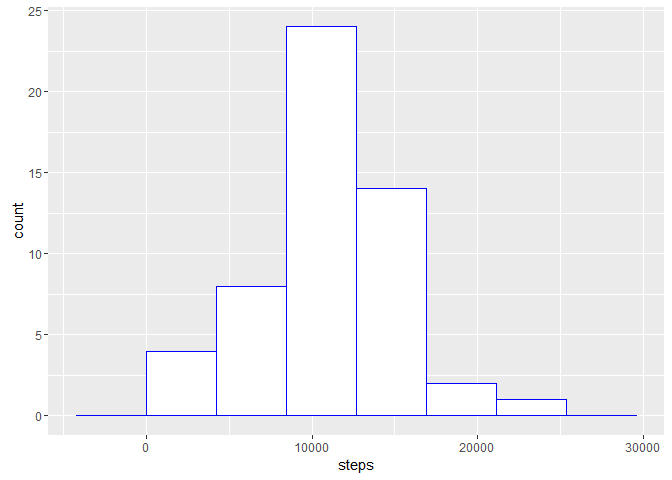
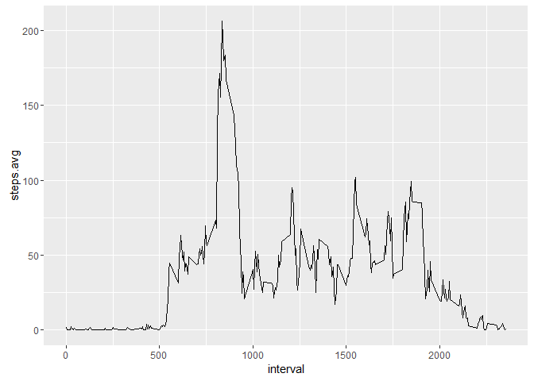
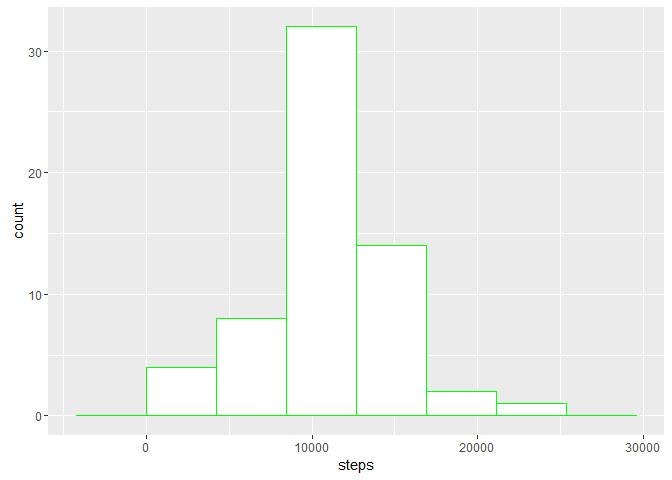
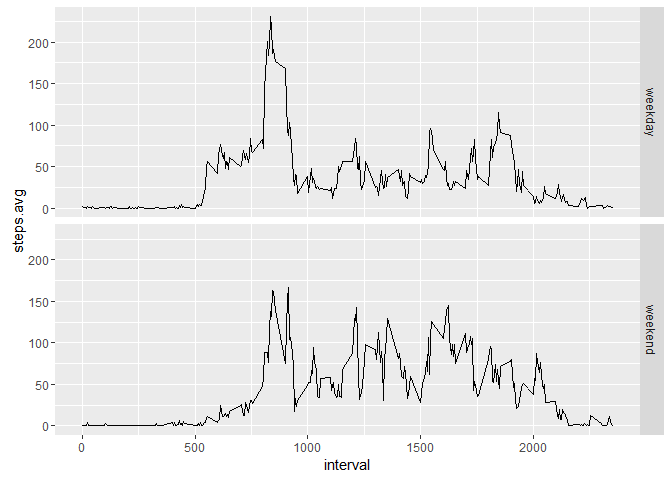

# Reproducible Research: Peer Assessment 1

This assignment makes use of data from a personal activity monitoring
device. This device collects data at 5 minute intervals through out the
day. The data consists of two months of data from an anonymous
individual collected during the months of October and November, 2012
and include the number of steps taken in 5 minute intervals each day.

*The R code in this assigment requires the following packagesto be loaded*


```r
   require(dplyr)
```

```
## Loading required package: dplyr
```

```
## 
## Attaching package: 'dplyr'
```

```
## The following objects are masked from 'package:stats':
## 
##     filter, lag
```

```
## The following objects are masked from 'package:base':
## 
##     intersect, setdiff, setequal, union
```

```r
   require(ggplot2) 
```

```
## Loading required package: ggplot2
```


## Loading and preprocessing the data

1. Load the data

If the file already exists, it is read into a data frame, otherwise it is downloaded
and/or unzipped before the data frame is created.


```r
inFile <-  "./data/activity.csv"
zipFile <- "activity.zip"

if (!file.exists(inFile)) {
    if (!file.exists(zipFile)) {
        download.file ("https://d396qusza40orc.cloudfront.net/repdata%2Fdata%2Factivity.zip",
                       zipFile)
    }
    unzip (zipFile,exdir="./data")
}

steps.all <- read.csv(inFile)
```

2. Process/transform the data 

The date column is changed to type "date" for later processing


```r
steps.all$date <- as.Date(steps.all$date)
```


## What is mean total number of steps taken per day?

1. Calculate the total number of steps taken per day

```r
steps.daily <- steps.all %>% 
    group_by(date) %>%
    summarise(steps=sum(steps))
```

2. Make a histogram of the total number of steps taken each day


```r
ggplot(steps.daily,aes(steps)) + geom_histogram(colour="blue",fill="white",bins=5,na.rm = TRUE)
```



3. Calculate and report the mean and median of the total number of steps taken per day


```r
mean(steps.daily$steps,na.rm = TRUE)
```

```
## [1] 10766.19
```

```r
median(steps.daily$steps,na.rm = TRUE)
```

```
## [1] 10765
```


## What is the average daily activity pattern?

1.  Make a time series plot of the 5-minute interval (x-axis) and the average 
    number of steps taken, averaged across all days (y-axis)

```r
steps.interval <- steps.all %>% 
    group_by(interval) %>%
    summarise(steps.avg=mean(steps,na.rm=TRUE))

qplot(interval, steps.avg,data=steps.interval,geom="line")
```




2.  Which 5-minute interval, on average across all the days in the dataset, contains the maximum 
    number of steps?

```r
steps.interval$interval[steps.interval$steps.avg == max(steps.interval$steps.avg)]
```

```
## [1] 835
```


## Imputing missing values

1. Calculate and report the total number of missing values in the dataset

```r
sum(is.na(steps.all$steps))
```

```
## [1] 2304
```

2.  Devise a strategy for filling in all of the missing values in the dataset. The strategy does 
    not need to be sophisticated. For example, you could use the mean/median for that day, or the 
    mean for that 5-minute interval, etc.
    
    The strategy chosen is to assign the average number of steps for each time period
    (as calculated above for the time series plot above, i.e. in steps.interval) for NA's.
    
    - The dplyr function left_join will be used to match the data rames on interval
    - A new column will be created that is either the steps value if it's not NA, else the steps.avg
    - Only keep the required columns and rename the new column to "steps" to keep consistency

3. Create a new dataset that is equal to the original dataset but with the missing data filled in.

```r
steps.imputed <- left_join(steps.all,steps.interval,by = "interval")
steps.imputed <- steps.imputed %>%
                    mutate(steps.new = ifelse(is.na(steps),steps.avg,steps)) %>%
                    select(date,interval,steps=steps.new) 
```

4. Make a histogram of the total number of steps taken each day and Calculate and report the mean 
    and median total number of steps taken per day. 

```r
steps.imputed.daily <- steps.imputed %>% 
    group_by(date) %>%
    summarise(steps=sum(steps))

ggplot(steps.imputed.daily,aes(steps)) + geom_histogram(colour="green",fill="white",bins=5,na.rm = TRUE)
```



```r
mean(steps.imputed.daily$steps)
```

```
## [1] 10766.19
```

```r
median(steps.imputed.daily$steps)
```

```
## [1] 10766.19
```
    


## Are there differences in activity patterns between weekdays and weekends?

1. Create a new factor variable in the dataset with two levels - "weekday" and "weekend" indicating 
    whether a given date is a weekday or weekend day.


```r
steps.weekday <- steps.imputed %>%
        mutate(weekday.flag=ifelse(weekdays(date)=="Saturday"|weekdays(date)=="Sunday","weekend","weekday"))
steps.weekday$weekday.flag <- as.factor(steps.weekday$weekday.flag)
```

 2. Make a panel plot containing a time series plot of the 5-minute interval (x-axis) 
    and the average number of steps taken, averaged across all weekday days or weekend days (y-axis). 


```r
steps.weekday.interval <- steps.weekday %>% 
    group_by(weekday.flag,interval) %>%
    summarise(steps.avg=mean(steps))

qplot(interval, steps.avg,data=steps.weekday.interval,geom="line",facets=weekday.flag ~ .)
```


